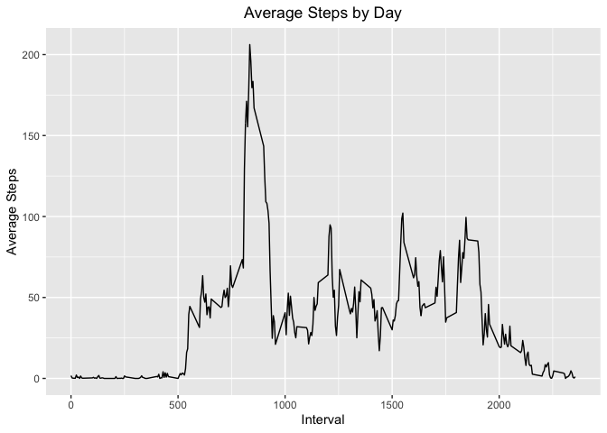

# Reproducible Research: Peer Assessment 1

## Loading and preprocessing the data


```r
if(!file.exists('activity.csv')){
    unzip('activity.zip')
}
activityData <- read.csv('activity.csv', header = TRUE)
```

## What is mean total number of steps taken per day?

1. Make a histogram of the total number of steps taken each day

```r
total.steps <- aggregate(steps ~ date, data = activityData, FUN = sum, na.rm = TRUE)
ggplot(total.steps, aes(x = total.steps$steps)) + geom_histogram() +
  labs(x = "Total Steps", y = "Count") + 
  ggtitle("Steps by Day") +
  theme(plot.title = element_text(hjust = 0.5))
```

```
## `stat_bin()` using `bins = 30`. Pick better value with `binwidth`.
```

<!-- -->

2. Calculate and report the ***mean*** and ***median*** total number of steps taken per day

```r
mean(total.steps$steps)
```

```
## [1] 10766.19
```

```r
median(total.steps$steps)
```

```
## [1] 10765
```

## What is the average daily activity pattern?

1. Make a time series plot (i.e. `type = "l"`) of the 5-minute interval (x-axis) and the average number of steps taken, averaged across all days (y-axis)

```r
steps.interval <- aggregate(steps ~ interval, data = activityData, FUN=mean)
ggplot(steps.interval, aes(x = steps.interval$interval, y = steps.interval$steps)) + 
  geom_line() + 
  labs(x = "Interval", y = "Average Steps") +
  ggtitle("Average Steps by Day") +
  theme(plot.title = element_text(hjust = 0.5))
```

<!-- -->

2. Which 5-minute interval, on average across all the days in the dataset, contains the maximum number of steps?

```r
steps.interval$interval[which.max(steps.interval$steps)]
```

```
## [1] 835
```

## Imputing missing values

1. Calculate and report the total number of missing values in the dataset (i.e.  the total number of rows with NAs)

```r
sum(is.na(activityData[,]))
```

```
## [1] 2304
```

2. We will use the mean for each day to fill the missing values in original dataset.

3. Create a new dataset that is equal to the original dataset but with the  missing data filled in.

```r
activityData <- merge(activityData, total.steps, by="date", suffixes=c("",".y"))
empty <- is.na(activityData$steps)
activityData$steps[empty] <- activityData$steps.y[empty]
activityData <- activityData[ ,1:3]
```

4. Check result

```r
sum(is.na(activityData[,]))
```

```
## [1] 0
```

5. Make a histogram of the total number of steps taken each day and Calculate 
and report the mean and median total number of steps taken per day. 

```r
total.steps <- aggregate(steps ~ date, data = activityData, FUN=sum)
ggplot(total.steps, aes(x = total.steps$steps)) + 
  geom_histogram() + 
  labs(x = "Total Steps", y = "Count") +
  ggtitle("Total Steps by Day") +
  theme(plot.title = element_text(hjust = 0.5))
```

```
## `stat_bin()` using `bins = 30`. Pick better value with `binwidth`.
```

<!-- -->

```r
mean(total.steps$steps)
```

```
## [1] 10766.19
```

```r
median(total.steps$steps)
```

```
## [1] 10765
```

## Are there differences in activity patterns between weekdays and weekends?

1. Create a new factor variable in the dataset with two levels - "weekday" and "weekend" indicating whether a given date is a working or weekend day.

```r
activityData$date <- as.Date(activityData$date)
GetDay <- function(date) {
    # Or "суббота", "воскресенье" - for russian locale
    day <- weekdays(as.Date(date)) %in% c("Saturday", "Sunday") 
}
activityData$IsWeekend <- as.factor(sapply(activityData$date, GetDay))
```

2. Make a panel plot containing a time series plot (i.e. type = "l") of the 5-minute interval (x-axis) and the average number of steps taken, averaged  across all weekday days or weekend days (y-axis). 

```r
steps.weekend <- aggregate(steps ~ interval, data = activityData, subset = activityData$IsWeekend == TRUE, FUN=mean)
steps.weekday <- aggregate(steps ~ interval, data = activityData, subset = activityData$IsWeekend == FALSE, FUN=mean)

ggplot() + 
  geom_line(data = steps.weekday, aes(x = steps.weekday$interval, y = steps.weekday$steps, color="Weekday")) +
  geom_line(data = steps.weekend, aes(x = steps.weekend$interval, y = steps.weekend$steps, color="Weekend")) + 
  labs(x = "Interval", y = "Average Steps") +
  ggtitle("Comparing average steps by working days and weekends") +
  theme(plot.title = element_text(hjust = 0.5))
```

<!-- -->
